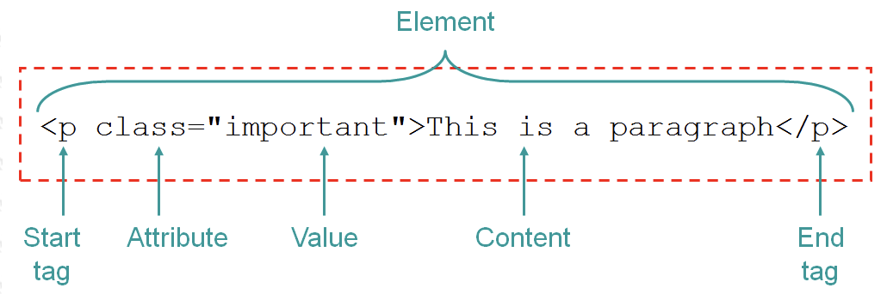

# HTML
    1. HTML describes the structure of a Web page.
    2. HTML consists of a series of elements.
    3. HTML elements tell the browser how to display the content.

## HTML file structure
```html
<html>
    <head>
        <title>My first html page</title>
    </head>
    <body>
        Lean with Navendu
    </body>
</html>
```

## Common HTML tags
    1. Heading (<h1> to <h6>): They are used to define different heading levels.
    2. Paragraph (<p>): It's used to make a long piece of text as a paragraph.
    3. Line break (<br>): Its used to introduce a line break.
    4. Horizontal Line (<hr>): This is used to draw a horizontal line across the page.
    5. Comment (<!--anything here--> or <comment>anything here</comment>): A section put inside a comment section
    is not displayed in the browser.
    6. Bold (<b>): This is used to display a text as bold.
    7. Italic (<i>): This is used to display a text as italic.
    8. Underline (<u>): This is used to underline a text.

## Hyperlinks
    <a href="https://www.YouTube.com/">Go to YouTube.com</a>

    <a href="https://www.YouTube.com/" target="_self">Go to YouTube.com</a>
    
    <a href="https://www.YouTube.com/" target="__blank">Go to YouTube.com</a>


## Images
    

## Tag, element and attributes
```html
<h1>My First Heading</h1>
<a href="https://www.youtube.com">YouTube</a>
```
There are 4 types of elements:
1. Container element
2. Empty element
3. Block level element
4. Text level element

___1. Container elements examples:___
```html
<h1>This is a heading</h1>
<h2>This is a heading</h2>
<h3>This is a heading</h3>
<h4>This is a heading</h4>
<h5>This is a heading</h5>
<h6>This is a heading</h6>
<p>This is a paragraph.</p>
<b>This is another paragraph.</b>
<i>This is another paragraph.</i>
<a href="https://www.google.com">This is a link</a>
```

___2. Empty elements examples:___

```html
<br>
<hr>
<link rel="stylesheet" href="https://www.w3schools.com/w3css/4/w3.css">
```

___3. Block level elements examples:___

    They take up full line width and causes line break, like <p>, <h1>, <hr> etc

___4. Text level elements examples:___
    
    They only take width needed and don't cause line break, like <b>, <i> etc


