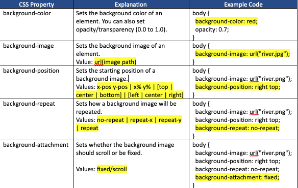
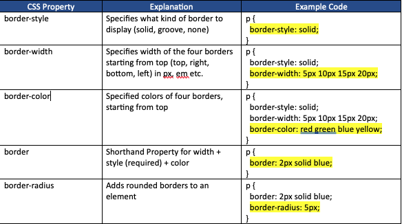
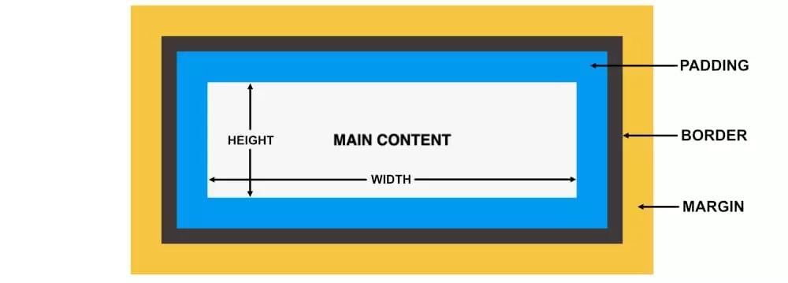

# CSS
HTML was not created to style web page. It was created just to give a structure to a page. CSS is used to style an HTML page.

## Syntax:
```css
selector {
    property1: value1;
    property2: value2;
}
```

## Selectors
The selector points to the HTML element you want to style.

1. `element` selector (element):  
   
   ```css
   div {
    color: blue
   }
   ```
   The style will get appled to all `div` elements on the page.

2. `id` selector (#):  
   
   ```css
   #main {
    color: blue
   }
   ```
   The style will get appled to all elements on the page with `id="main"`.

3. `class` selector (.):  
   
   ```css
   .main {
    color: blue
   }
   ```
   The style will get appled to `all` elements on the page with `class="main"`.

   ```css
   div.main {
    color: red
   }
   ```
   The style will get appled to only `div` elements on the page with `class="main"`.

4. `universal` selector (*):  
   
   ```css
   * {
    color: blue
   }
   ```
   The style will get appled to `all` elements on the page.

4. `grouped` selectors (*):  
   
   ```css
   p, h2, div {
    color: blue
   }
   ```
   The style will get appled to `p`, `h2` and `div` elements on the page.

5. `attribute` selectors ([attribute]):  
   
   ```css
   a[target] {
    color: blue
   }
   ```
   The style will get appled to all `a` elements on the page that has a `target` attribute.

6. `attribute=value` selectors ([attribute="value"]):  
   
   ```css
   a[target="_blank"] {
    background-color: blue
   }
   ```
   The style will get appled to all `a` elements on the page that has `target` attribute with the value of `"_blank"`.

7. `attribute~=value` selectors ([attribute~="value"]):  
   
   ```css
   [title="school"] {
    background-color: blue
   }
   ```
   The style will get appled to all elements on the page that has an attribute named `title` and value contains the word `"school`.


## 3 ways of writing CSS
#### 1. Inline:

```css
    <p style="color: red"></p>
```

#### 2. Internal
```css
<style type="text/css">
    p {
        color: red;
        font-family: verdana;
        font-size: 20px;
        background-color: yellow;
    }

    body {
        background-color: lightblue;
    }
 
    h1 {
        color: white;
        text-align: center;
    }
</style>
```

#### 3. External
```css
<link rel="stylesheet" type="text/css" href="style.css" />
```

## Styles cascades from top to bottom

```css
<style type="text/css">
    p { 
        color: red;
    }

    /* This will override above style */
    p { 
        color: blue;
    }
</style>
```

## Priority order for duplicate styles

1. Inline style (inside an HTML element)
2. External and internal style sheets (in the head section)
3. Browser default (user agent stylesheet)

So, an inline style has the highest priority, and will override external and internal styles and browser defaults.

## CSS Comments
```css
/* This is a comment */
```

## CSS Color property:

Colors can be specified using `predefined color names` or `RGB` or `HEX codes (#RRGGBB)`.

    Examples of predefined color names are Red, Blue, Orange etc
    Examples of RGB color names are rgb(255, 99, 71) etc
    Examples of HEX color names are #ff0000, #3cb371 etc

Note: `#ff00cc` can also be written as `#f0c`, 3 digits, if there is color component duplication.

## `padding` and `margin` property:
The CSS `padding` properties are used to generate space around an element's content, `inside of any defined borders`.  

```css
div {
  padding-top: 10px;
  padding-right: 10px;
  padding-bottom: 10px;
  padding-left: 10px;
}

OR

div {
  padding: 10px 10px 10px 10px;
}

OR

div {
  padding: 10px;
}
```

`Margins` are used to create space around elements, `outside of any defined borders`.
```css
div {
  margin-top: 10px;
  margin-right: 10px;
  margin-bottom: 10px;
  margin-left: 10px;
}

OR

div {
  margin: 10px 10px 10px 10px;
}

OR

div {
  margin: 10px;
}
```
Example:
```html
<html>
<head>
    <style>
        div {
            border: 2px solid black;
            background-color: yellow;
            margin: 80px;
            padding: 10px;
        }
    </style>
</head>
<body>
    <h2>Using margin</h2>
    <div>This div element has a margin of 80px on all sides.</div>
</body>
</html>
```
## background property:



## `url` (absolute vs relative)
The `url()` function is a way to specify that you are providing a URL (Uniform Resource Locator) to an external resource, in this case, an image. This is a clear and standardized way to define the source of the image.

`Using relative path:`  
background-image: url("gradient_bg.png");

`Using absolute URL:`  
background-image: url("https://example.com/images/gradient_bg.png");

## Border properties:


## Text propoerties
`color: `Sets the color of the text (color name | color code)
```css
h1 
{ 
    color: green; 
}
```

`text-align: `Sets the horizontal alignment of a text (left | center | right)
```css
h1 {
    text-align: center;
}
```

`font-family: `Sets the font of a text.
```css
h1 {
    font-family: Arial;
}

Fallback (left to right), for browser compatibility
.p2 {
  font-family: Arial, Helvetica, sans-serif;
}
```

`font-style: ` normal | italic  
`font-weight: ` normal | bold
`font-size: ` 40px

## `display` property (Controls layout):

The CSS `display` property is used to control how an HTML element is rendered on a web page.
1. `block`:
   - Elements with `display: block;` create a block-level box, taking up the full width available within their parent container.
   - They start on a new line and stack vertically on top of each other.
   - Examples of block-level elements include `<div>`, `<p>`, and headings like `<h1>`, `<h2>`, etc.

2. `inline`:
   - Elements with `display: inline;` create an inline-level box.
   - They do not start on a new line and only take up as much width as necessary.
   - Examples of inline elements include `<span>`, `<a>`, and text within a paragraph.

3. `none`:
   - Elements with `display: none;` are not rendered on the page.
   - The element and its space in the layout are removed.
   - This is commonly used for hiding and showing elements dynamically with JavaScript.

4. `flex`:
   - The `display: flex;` property is used to create a flexible container that allows its child elements to be laid out in a flexbox format.

The choice of `display` value depends on the desired layout and behavior for the specific HTML element.

## Should I use `em` or `px` or `%`?
`em`, `px` and `%` are all units of measurement used for specifying the size and dimensions of elements on a web page.

1. `px (Absolute unit):`  
    1 `px` = 1 screen pixel. And the size is not influenced by the font size of the parent or any other relative factors.

2. `em (Relative unit):`  
    `em` is based on the font size of the parent element. 1 em = font size of the current element. So, if you set an element's font size to 1.5 em, it will be 1.5 times the size of its parent element's font size.

3. `% (Relative unit):`  
    `%` is also based on the font size of the parent element.

```css
.parent {
  font-size: 16px;
}

.child {
  font-size: 50%; /* The child will be 50% of the parent's width, or 150px. */
}
```

So, use `em` for scalability and responsiveness, `px` for fixed and precise sizes, and `%` for relative sizing within parent elements, which is useful for responsive and fluid layouts.

## CSS Box Model
The CSS box model is essentially a box that wraps around every HTML element. 


